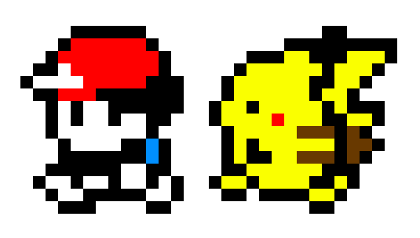

# Pika-Pika
My take on a runner based 2D game with enemies, walls and coins 

### To build the game
```bash
$ mkdir build 
$ cd build
$ cmake ..
$ make
$ cd ..

```
### To run the game
```bash
$ bash run.sh
```
### Task
You can control pikachu using w,a,s,d keys. Main objective of the game is to protect pikachu and collect thunder. Altho the game doesnot end here. The path to the greatball has walls and enemies like gyarados that can harm pikachu. Collect thunders to get points and collect thunder in dark to get even more points. Help pikachu reach the greatball. 

### Controls
```
w: move up
a: move left
s: move down
d: move right
e: turn of the lights
```

